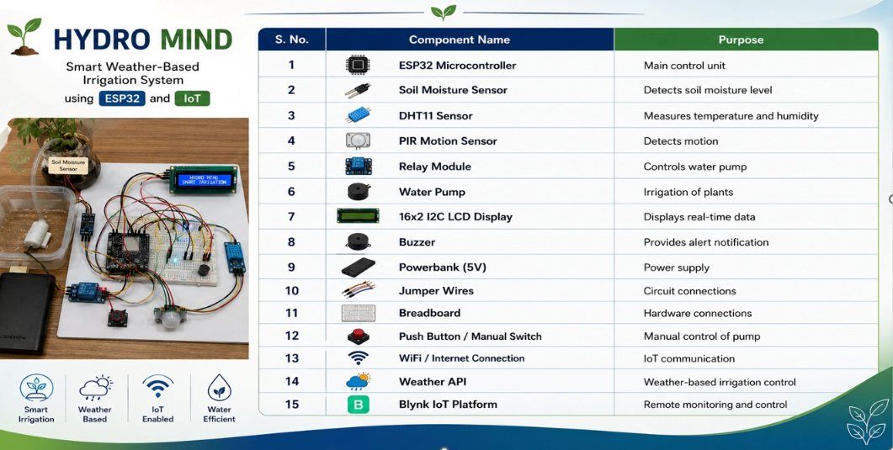
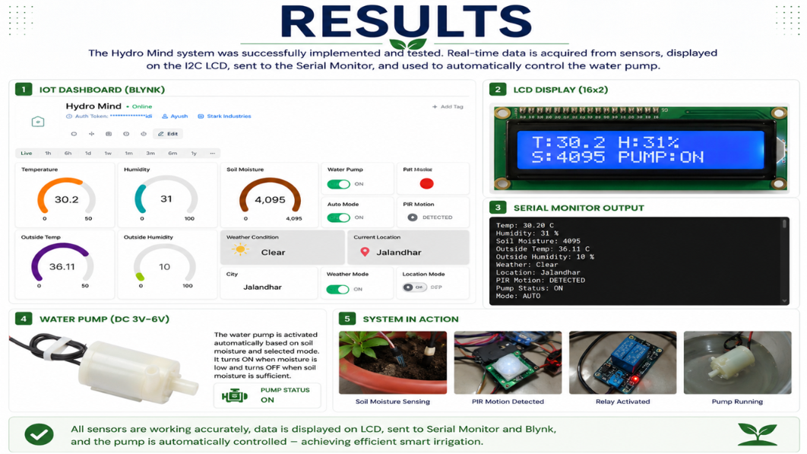

# 🌱 HYDRO MIND

## Smart Weather-Based Irrigation System using ESP32 and IoT

HYDRO MIND is a smart irrigation system designed to automate plant watering using **soil moisture, temperature, humidity, motion detection, and real-time weather information**.

The system uses an **ESP32** as the main controller and integrates with **Blynk IoT** for remote monitoring and control. Weather data is obtained through the **OpenWeather API** to help prevent unnecessary watering during rain.

---
## 📸 Project


## 🔌 Components



## 📊 Result


---

## 🚀 Features

- 🌱 Automatic irrigation based on soil moisture
- 🌦️ Weather-based irrigation control
- 💧 Automatic water pump control
- 📱 Blynk IoT dashboard for remote monitoring
- 🌡️ Temperature monitoring
- 💦 Humidity monitoring
- 🌱 Soil moisture monitoring
- 🚶 PIR-based motion detection
- 🔔 Buzzer alert for motion detection
- 📺 16×2 I2C LCD display
- 🎛️ Manual and automatic pump modes
- 📍 Location-based weather monitoring
- ☁️ Real-time weather information using OpenWeather API

---

## 🛠️ Technologies Used

### Hardware

- ESP32
- DHT11 Temperature & Humidity Sensor
- Soil Moisture Sensor
- PIR Motion Sensor
- Relay Module
- Water Pump
- 16×2 I2C LCD
- Buzzer
- LEDs
- Breadboard
- Jumper Wires
- 5V Power Bank

### Software & Services

- Arduino IDE
- C++
- Blynk IoT
- OpenWeather API
- ArduinoJson
- ESP32 Wi-Fi

---

## ⚙️ How It Works

The ESP32 continuously collects data from the connected sensors.

### 1. Soil Moisture Monitoring

The soil moisture sensor measures the moisture level of the soil.

When the soil becomes sufficiently dry, the system can automatically activate the water pump.

### 2. Weather Monitoring

HYDRO MIND retrieves weather information using the OpenWeather API.

If rain, drizzle, or a thunderstorm is detected, automatic irrigation is prevented to avoid unnecessary water usage.

### 3. Automatic Irrigation

The ESP32 evaluates the sensor and weather conditions and controls the relay connected to the water pump.

```text
Soil Moisture
      ↓
    ESP32
      ↓
Check Weather
      ↓
 ┌────┴────┐
 │         │
Rain     No Rain
 │         │
Pump OFF  Check Soil
             ↓
        Dry Soil?
          /    \
        Yes     No
         ↓       ↓
      Pump ON  Pump OFF
